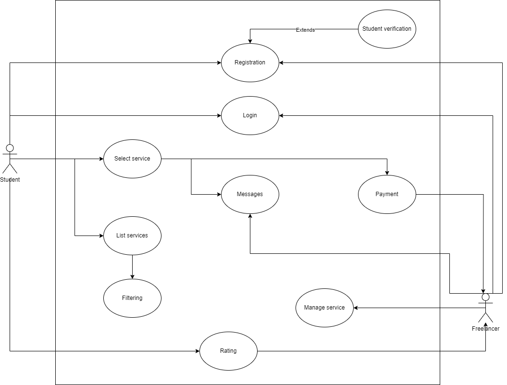

# PROJECT Design Documentation

> _The following template provides the headings for your Design
> Documentation.  As you edit each section make sure you remove these
> commentary 'blockquotes'; the lines that start with a > character
> and appear in the generated PDF in italics._

## Team Information
* Team name: TEAMNAME
* Team members
  * Lucille Blain
  * Vanessa Nava-Camal
  * Jose Palomino Lau
  * Vinayaka Viswanatha
  * Sai Sandeep Ramavath

## Executive Summary

When in college, many students are limited to part-time jobs while balancing their courses, to manage their finances. Even then students try not to spend too much since they might not have a regular income. On the other hand, some students might not have time or might need help but cannot go to the school’s tutoring hours due to other commitments. The goal of this application is to allow students with free time to offer their services,such as cooking meals, and tutoring, to other students who might need help in some sort of way. In other words a student freelancing app for RIT students. 
There exist a plethora of unexplored opportunities for students to reach out to each other hence the desirability of a centralized location for all of those ideas to ensemble. This app would fulfill that dream.

## Requirements

This section describes the features of the application.

### Definition of MVP

*Registration*
  * Users will be able to create their own account to have access to the platform. They will need to input a valid username, email and password to create it successfully. In case they have a mistake the system will send a message with the validation error.

*Login*
  * Users will be able to access the platform only if they have a valid account.
    
*Manage profile*
  * Users will be able to create,delete, and update from profiles. If  the person is using an edu/school afflicted email.,they can also verify their account as a student.

*Manage services*
  * Freelancers will be able to create, delete and manage a service they want to provide to other students. Students will also be able to see what services are available from what student.

*Filtering / Searching services*
  * A student will be able to compare other services available.
     
*Scheduling the services*
  * A freelance student should be able to schedule a service to a designated student.

*Manage notifications*
   * Users will receive notifications related to their projects and bids, so they can stay informed.

*Simple messaging*
  * Users will be able to use the messaging feature to communicate directly with clients, so they can discuss project details and updates.
    

*Review/ Rating System*
  * Students will be able to leave a rating (eg., 1-5) after receiving a service.
 
*Payment*
 * Students will be able to pay freelancers directly for the services they book.

### MVP Features
* Epics and Stories
  * Registration
    * As a user I want to be able to create an account, so I can login into the system
  * Login
    * As a user I was to be able to verify my account credentials through the system, so it verifies that it is valid.
  * Manage profile
  
    * As a freelance student, I want to be able to have privacy, so that only those interested in my service can see me
    * As a student, I want to see someone’s verification, so I can know they are a student

  * Manage services

    * As a student I want to be able to see all the services available, so I can see which kind of services are available
    * As a student, I want to compare multiple freelancers side by side, so I can make a more informed decision based on price, availability, and reviews.

  
  * Filtering / Searching services
     * As a student I want to filter different services, so I can get what I want more specifically.
     * As a student, I want to receive recommendations based on my previous bookings or searches, so I can discover relevant services more easily.
  * Scheduling the services
    * As freelance student should be able to schedule a service to a designated student.
    * As a freelance student, I want to show my availability, so my customers can plan accordingly.
  * Manage notifications
    * As a client I should be able to get the notification when I receive a message from the freelancer.
    * As a freelancer student I should be able to get the notifiction when a client assigns me for a project.
    * As a freelancer student I should be able to get the alerts of the deadline of the project.
    * As a client I should be able to get the notification when the task assigned is completed by the freelance student. 
  * Simple messaging
    * As a Client/ Freelacner I should be able to send message to Freelancer/Client to discuss regarding the project details.
  * Review/ Rating System
    * As a student, I want to rate the freelancer’s service, so I can provide feedback based on my experience.
  * Payment
    * As a student, I want to pay the freelance student directly through the platform, so I can complete the transaction securely.

### Acceptance Criteria

  * Register
    * The user create his account and after that it should return a message of creation success
    * All the inputs should have a message of validation to guide the user
   
  * Login
    * The user login succefully into the system, the system returns a message of success
      
  * Filtering / Searching services 
    * The search should return an exact list of candidates matching the user's keywords. 
    * The search request should be shown in a suggestion tab with an organized and clear UI. 
     
  * Scheduling the services 
    * The booking listed should be shown accurately on the user's "schedule" tab. 
    * The availability must exactly match the user's entered timeframed. 

## Architecture and Design

This section describes the application architecture.

### Software Architecture
> _Place a architectural diagram here._
> _Describe your software architecture._

### Use Cases

### Class Diagram
> _Place a class diagram here._
> _Describe your class diagram._
